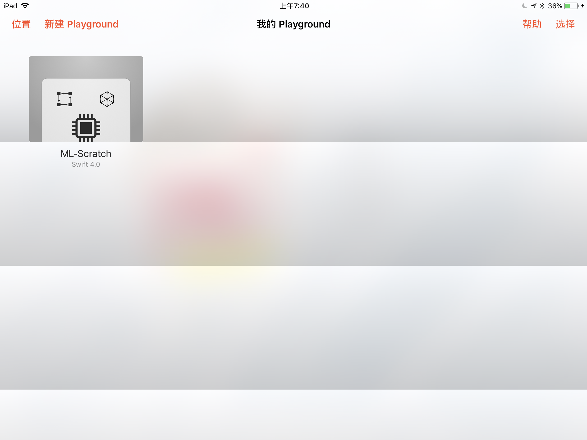
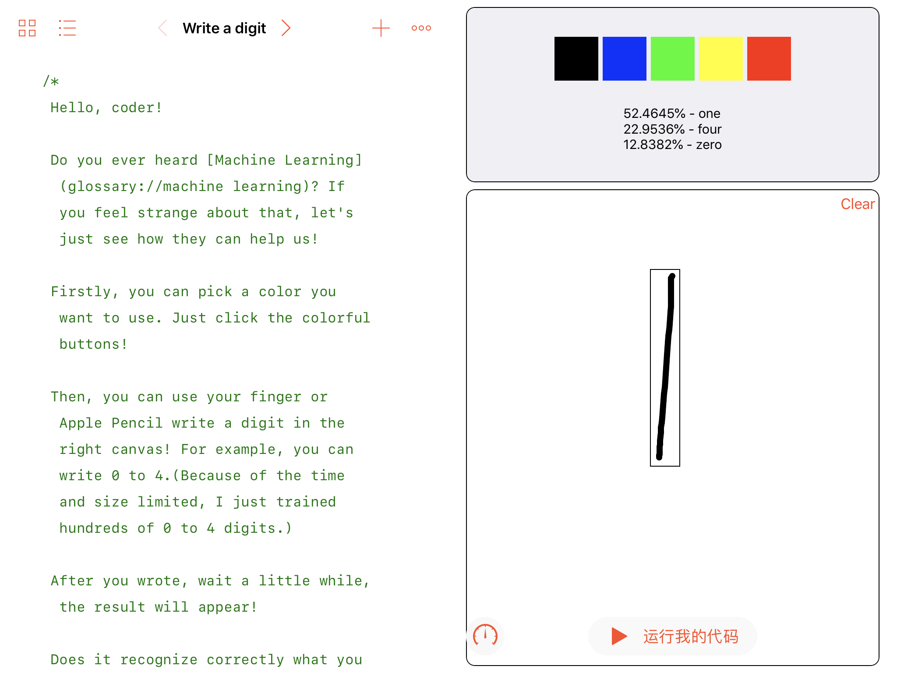
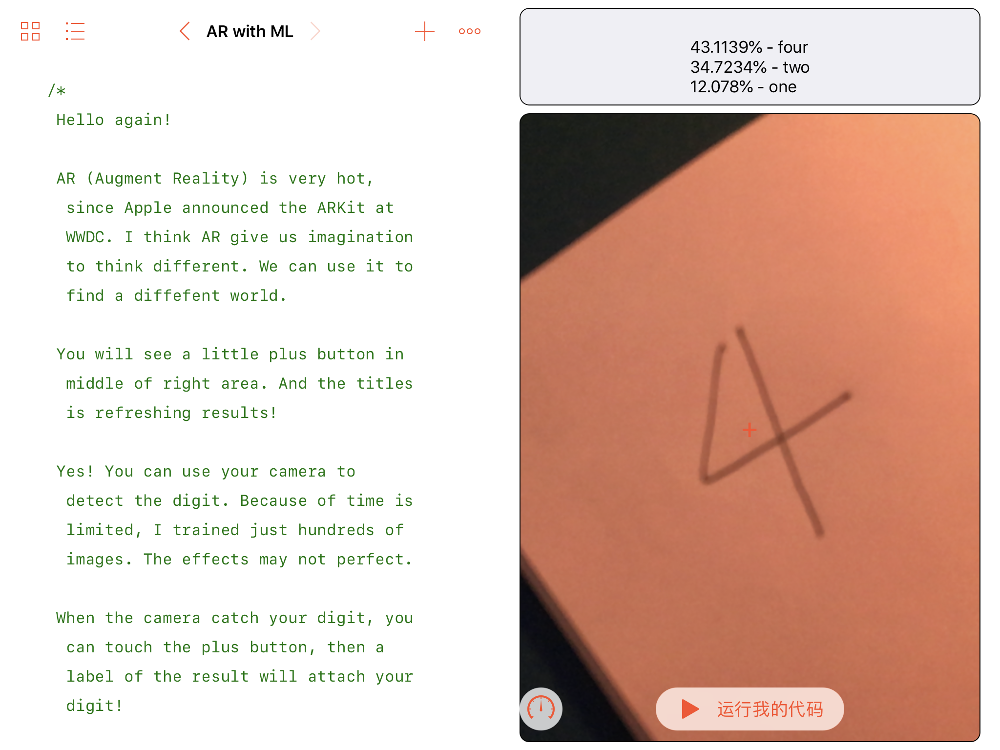

# ML-Scratch

My application for WWDC18 Scholarship.

Status: **[Submitted]**

## Languages

- Swift 4.0
- Python 2.7

## Screenshots

## Frameworks

- Vision
- CoreML
- ARKit
- SceneKit
- Turi Create

## LICENSE

MIT
